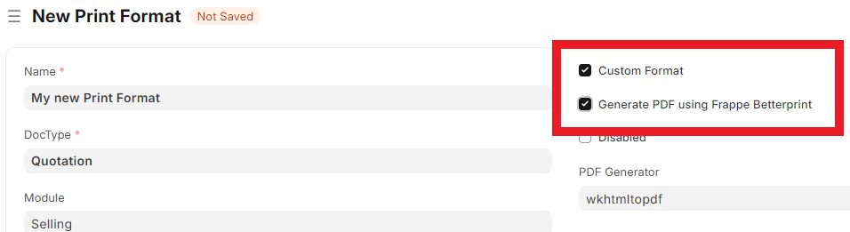

# Quick-start Guide

### Set up our first Print Format with Betterprint

Create a new Print Format and Check "Custom Format". This will reveal a new Checkbox, "Generate PDF using Frappe Betterprint".&#x20;


Enabling Frappe Betterprint will enable various defaults:&#x20;

* Preview will be rendered in Pages with automatic page breakes
* PDF generation by Chromium based renderer
* Enable dynamic header & footer


Make sure to check both of these:

<figure><figcaption></figcaption></figure>

### Time to add some content

Frappe Betterprint is based on Jinja Print formats with modern CSS support and dynamic header and footer.&#x20;


Frappes repeated header & footer won't work in Frappe Betterprint. In order to add header  & footer, please refere to [dynamic header & footer article](features/dynamic-header-and-footer.md) in the docs


In order to add Contents to your Print Format, here are some helpful links to get started:&#x20;

* [Betterprint-specific Jinja examples (Footer/Header...)](features/betterprint-specific-jinja-examples.md)
* [Frappe Documentation of Jinja Print Formats](https://docs.frappe.io/erpnext/user/manual/en/records-print-format#html-print-format)

